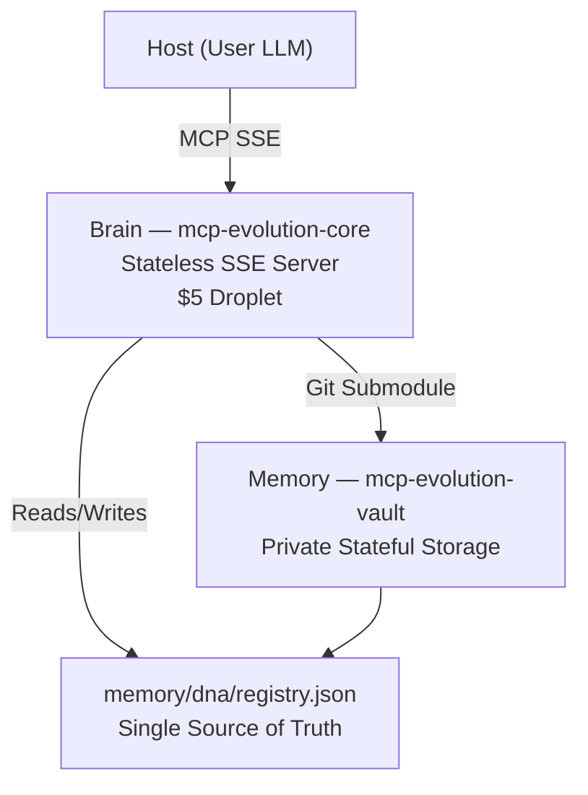
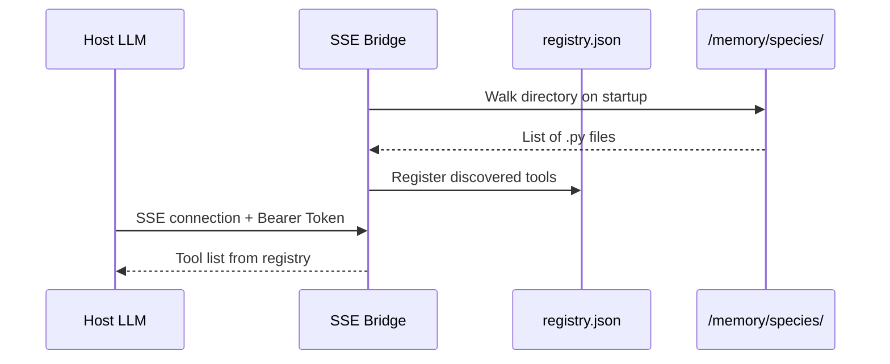
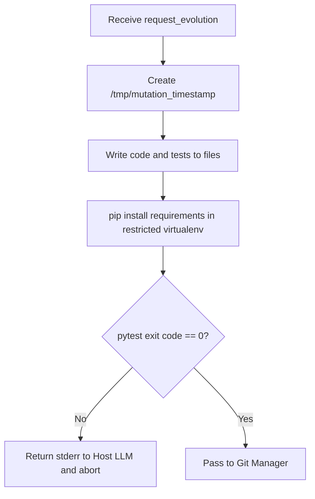
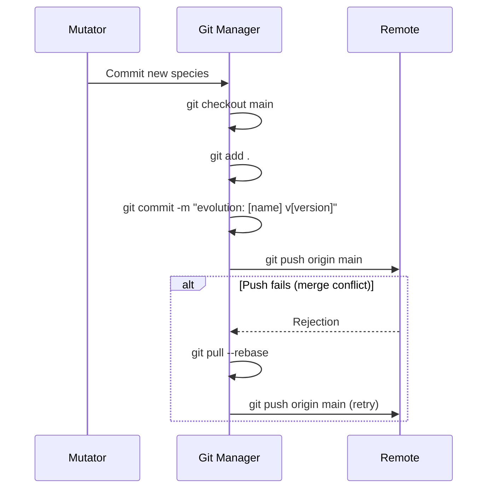
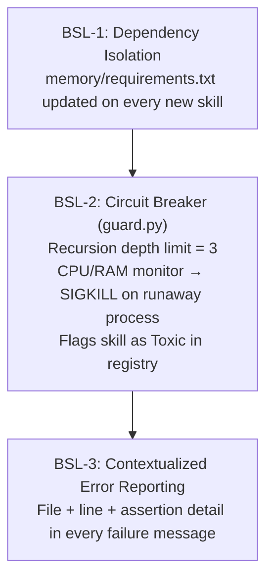

# Master Technical Manifesto: Darwin-God-MCP

This document defines the API contracts, Git state machine, and Sandbox isolation in granular detail. It is the authoritative low-level specification for the Darwin-God-MCP system.

---

## 1. System Integration Map

The system operates as a **Triad**: The Host (User LLM), The Brain (Logic), and The Memory (Data).



### Repositories

| Repo | Alias | Visibility | Role | Deployment |
|------|-------|------------|------|------------|
| `mcp-evolution-core` | The Brain | Public | Stateless MCP SSE Server | $5 Droplet |
| `mcp-evolution-vault` | The Memory | Private | Stateful Git Submodule | Cloned into `/memory` inside Brain directory |

---

## 2. Component-Level Specifications

### A. SSE Bridge — `brain/bridge/sse_server.py`

The "Membrane." Handles remote connections from the Droplet.

| Property | Value |
|----------|-------|
| Protocol | `mcp.server.lowlevel.Server` via `SseServerTransport` |
| Security | `Bearer Token` check in HTTP headers |
| Discovery | On startup, walks `/memory/species`, registers every `.py` file into `registry.json` |



### B. Mutation Engine — `brain/engine/mutator.py`

The "Ribosome." Performs "Viral Synthesis."

**API Contract — `request_evolution`**

| Field | Type | Description |
|-------|------|-------------|
| `name` | `str` | The skill name |
| `code` | `str` | The Python logic |
| `tests` | `str` | The Pytest logic |
| `requirements` | `List[str]` | External pip packages |

**Logic Flow**



### C. Git Manager — `brain/utils/git_manager.py`

The "Reproductive System." Operates strictly within the `/memory` path.

**Command Sequence**



---

## 3. The Genome — `memory/dna/registry.json`

The AI must treat this file as the **Single Source of Truth**. No tool exists if it is not registered here.

```json
{
  "organism_version": "2.0.0",
  "last_mutation": "2026-04-18T10:00:00Z",
  "skills": {
    "pdf_parser": {
      "path": "species/native/pdf_parser.py",
      "entry_point": "parse_pdf",
      "runtime": "python3.10",
      "dependencies": ["pypdf2"],
      "input_schema": {
        "type": "object",
        "properties": {
          "file_path": { "type": "string" }
        }
      },
      "meta": {
        "evolved_at": "...",
        "parent_request": "..."
      }
    }
  }
}
```

---

## 4. Operational Guardrails (Biosafety Levels)



### BSL-1: Dependency Isolation

The Brain maintains `memory/requirements.txt`. Every new skill evolved with a new dependency appends to this file and triggers a local environment rebuild.

### BSL-2: Circuit Breaker — `brain/engine/guard.py`

| Trigger | Action |
|---------|--------|
| Mutation-to-fix-mutation depth > 3 | Open GitHub Issue, halt chain |
| Subprocess CPU/RAM runaway | `SIGKILL` process, mark skill as `"Toxic"` in registry |

### BSL-3: Error Reporting

Errors must always be **contextualized**:

| | Example |
|-|---------|
| Bad | `"Test failed."` |
| Good | `"Mutation failed at line 42 of tests/test_parser.py. AssertionError: expected 'A', got 'B'. Please refactor DNA and re-infect."` |

---

## 5. Full Build Prompt

> Architect the **Darwin-God-MCP** triad.
>
> 1. **Brain:** Create a Python SSE MCP Server in `brain/`. It must be stateless and load all tool definitions from `../memory/dna/registry.json`.
> 2. **Memory:** Create a submodule structure in `memory/` for private storage of scripts and schemas.
> 3. **The Viral Tool:** Implement `request_evolution`. It must accept Python code, write it to the submodule, run `pytest`, and if successful, perform a Git push to the submodule remote.
> 4. **Git State Machine:** Implement a robust Git manager that handles branch tracking and push/pull logic within the submodule directory.
> 5. **Hot Reload:** Use a file watcher (`watchdog`) or the MCP `list_changed` notification to ensure the IDE sees new tools immediately after mutation without a restart.
> 6. **Strictness:** Use Type Hints and `pathlib` for all file operations. No hardcoded absolute paths.

---

## 6. Systemd Service

To survive reboots and crashes on the $5 Droplet, generate a `darwin.service` unit file so the organism self-resurrects.

```ini
[Unit]
Description=Darwin-God-MCP Brain
After=network.target

[Service]
Type=simple
WorkingDirectory=/opt/mcp-evolution-core
ExecStart=/opt/mcp-evolution-core/.venv/bin/python -m brain.bridge.sse_server
Restart=on-failure
RestartSec=5

[Install]
WantedBy=multi-user.target
```
